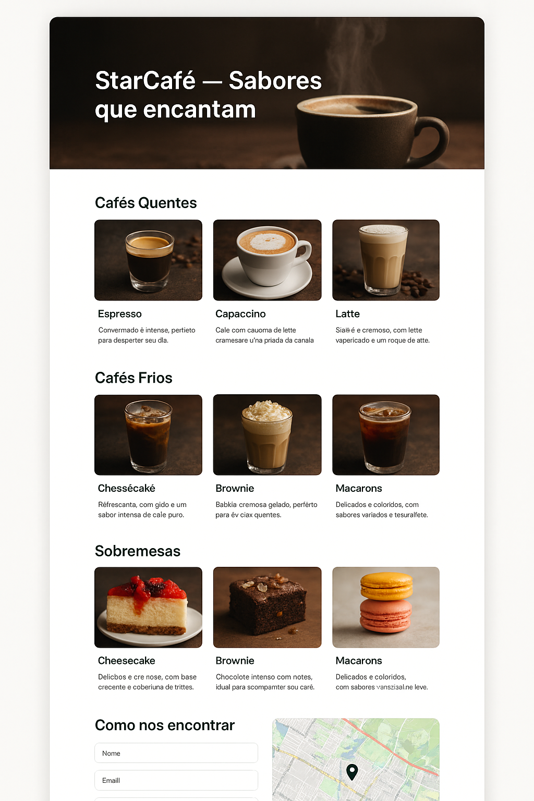

# **Tutorial Passo a Passo — Navbar do Site da Cafeteria StarCafé**

Este é o **primeiro passo** para criar o site da Cafeteria StarCafé, inspirado no estilo visual da Starbucks.
Aqui vamos criar a **estrutura HTML inicial**, implementar a **navbar** e definir a **base do CSS**.

## Mockup



---

## **1. Visão Geral**

No final desta parte, teremos:

* Um documento HTML estruturado.
* Uma barra de navegação fixa no topo (navbar).
* Um cabeçalho com imagem de fundo.
* Estilos básicos aplicados.

---

Entendi — vou dividir a **estrutura HTML** em fragmentos menores e explicar passo a passo.
Assim, cada parte fica isolada e fácil de entender antes de avançar.

---

# **Tutorial Passo a Passo — Navbar do Site da Cafeteria StarCafé**

Este é o **primeiro passo** para criar o site da Cafeteria StarCafé, inspirado no estilo visual da Starbucks.
Vamos montar a **estrutura HTML** e iniciar os **estilos CSS**.

---

## **1. Estrutura HTML Base**

Começamos com o **esqueleto do documento HTML**:

```html
<!DOCTYPE html>
<html lang="pt-BR">
<head>
    <meta charset="UTF-8" />
    <meta name="viewport" content="width=device-width, initial-scale=1" />
    <title>Cafeteria Estilo Starbucks</title>
    <!-- Ícone da aba do navegador -->
    <link rel="icon" href="https://cdn1.iconfinder.com/data/icons/coffee-163/128/Hot_green_Coffee-512.png" type="image/png" />
</head>
<body>
    <!-- Aqui entra o conteúdo -->
</body>
</html>
```

**O que está acontecendo aqui:**

* `<!DOCTYPE html>` → indica HTML5.
* `<html lang="pt-BR">` → define o idioma.
* `<meta charset="UTF-8">` → suporte a acentos.
* `<meta name="viewport">` → responsividade.
* `<title>` → título na aba.
* `<link rel="icon">` → ícone da aba.

---

## **2. Navbar (Barra de Navegação)**

A **navbar** será fixa no topo e terá o logotipo e os links principais.

```html
<nav id="navbar">
    <div class="logo">StarCafé</div>
    <ul id="menu">
        <li><a href="#cafe-quente">Café Quente</a></li>
        <li><a href="#cafe-frio">Café Frio</a></li>
        <li><a href="#sobremesas">Sobremesas</a></li>
        <li><a href="#contato">Contato</a></li>
    </ul>
</nav>
```

**Notas:**

* `<nav>` → área de navegação.
* `.logo` → nome da marca.
* `<ul>` → lista de links para seções internas.

---

O **header** terá uma imagem de fundo e um título.

```html
<header>
    <h1>StarCafé — Sabores que encantam</h1>
</header>
```

**Notas:**

* `<header>` → bloco principal de destaque do site.
* `<h1>` → título principal que será exibido sobre a imagem de fundo.

---

## **3. Estilos CSS Base**

Começamos com um **reset CSS** e definimos fonte, cores e layout básico.

```css
/* Reset e base */
* {
    margin: 0;
    padding: 0;
    box-sizing: border-box;
}

body {
    font-family: 'Segoe UI', Tahoma, Geneva, Verdana, sans-serif;
    background: #f4f4f4;
    color: #333;
    line-height: 1.6;
}
```

---

## **4. Estilos da Navbar**

```css
/* Navbar */
nav {
    position: fixed;
    top: 0;
    width: 100%;
    background: transparent;
    color: white;
    display: flex;
    justify-content: space-around;
    align-items: center;
    padding: 16px 32px;
    z-index: 1000;
    transition: background 0.3s ease, box-shadow 0.3s ease;
}

nav.scrolled {
    background: #006241; /* verde Starbucks */
    box-shadow: 0 2px 5px rgba(0, 0, 0, 0.3);
}

nav .logo {
    font-weight: bold;
    font-size: 24px;
    letter-spacing: 2px;
}

nav ul {
    list-style: none;
    display: flex;
    gap: 32px;
}

nav ul li a {
    color: white;
    text-decoration: none;
    font-weight: 600;
    transition: color 0.3s ease;
}

nav ul li a:hover {
    color: #a3d2ca;
}
```

**O que acontece aqui:**

* Navbar **fixa** no topo (`position: fixed`).
* Começa **transparente** e muda para verde com sombra ao rolar a página (classe `.scrolled`).
* Menu horizontal com espaçamento (`gap`).

---

## **5. Estilos do Cabeçalho**

```css
/* Cabeçalho */
header {
    background: url('https://images.unsplash.com/photo-1600093463592-8e36ae95ef56?q=80&w=1170&auto=format&fit=crop&ixlib=rb-4.1.0') 
    no-repeat center center/cover;
    height: 70vh;
    display: flex;
    justify-content: center;
    align-items: center;
    color: white;
    text-shadow: 2px 2px 6px rgba(0, 0, 0, 0.7);
    padding: 0 16px;
    padding-top: 60px; /* compensa altura da navbar */
    text-align: center;
}

header h1 {
    font-size: 48px;
    max-width: 700px;
    line-height: 1.2;
    animation: fadeInDown 1.5s ease forwards;
}
```

---

## **6. Próximo Passo**

Na **segunda parte** do tutorial, vamos:

* Adicionar seções para cada categoria de café.